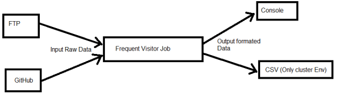
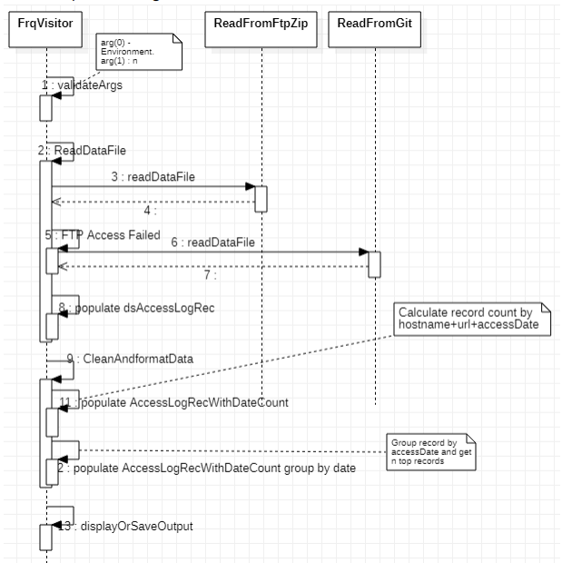
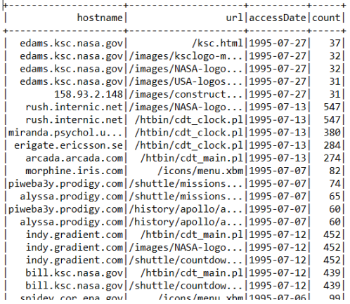
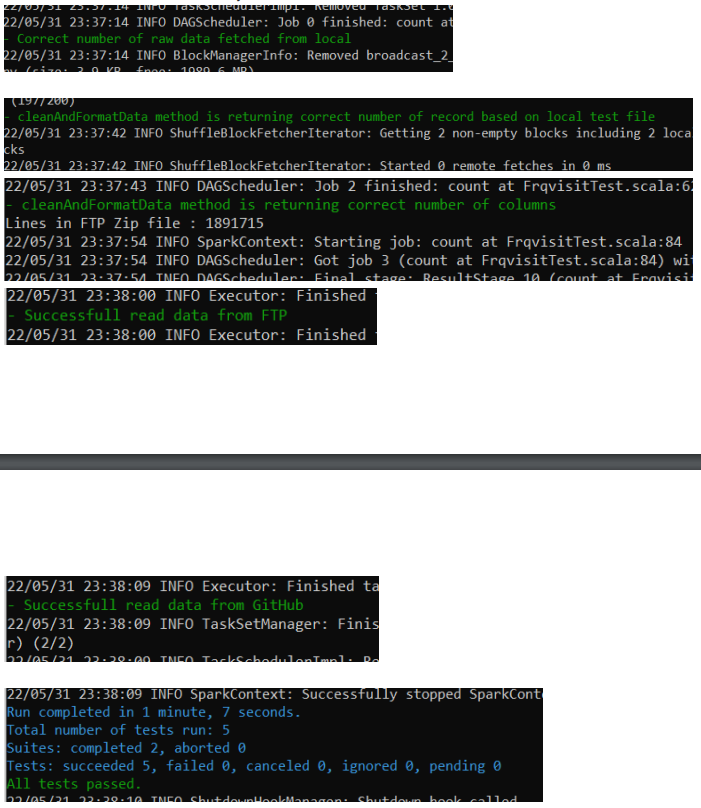

# Find top-n most frequent visitors and visited urls for each day of the trace from Nasa access file.

## Contributors
Suvro Dey

## Project Requirement
- Develop code in Scala
- Read the file from FTP Data file location - ftp://ita.ee.lbl.gov/traces/NASA_access_log_Jul95.gz
- Use Apache Spark to find the top-n most frequest visitors and visited urls for each day of the trace.
- Download data file from Ftp location and upload in GitHub data file location -https://github.com/suvrodey1/frqvisitor/blob/main/NASA_access_log_Jul95
- Pull data from the given FTP location first. Otherwise, from Github.
- Use Apache Spark to determine the top-n most frequent visitors and urls for each day of the trace

## File Detail
### Source Code
- FrqVisitor.scala - Main class
- ReadFromFtpZip.scala - To read the data from ftp folder
- ReadFromGit.scala - To read the data from GitHub
- pom.xml - Used by Maven to build the jar file.

### Test Data file used to test
access_log_Aug95_temp.zip - Unzip and store it in my local machine

### Executable Jar File
target/frqvisit-1.0.0-jar-with-dependencies.jar

## Data Flow
  

## Sequence Diagram

## Output Report Detail
- In the local environment the output will be displayed in the console. And the format will be as below -  
**Hostname** : Client Host  
**Url** - URL visited  
**dateAccess** - Date when url accessed.  
**Count** - Number of times the data accessec.  
Below table is showing top 5 records per day i.e. n is 5  
  

**Explanation**  
The first row of the report is showing the host ""edams.ksc.nasa.gov" accessed url "/ksc.html" on 1295-07-27 37 times.
 
  
## Steps to Build Jar File
-  Download pom and Src file
-  mvn package  
The out put jar file should be created in target folder.

## Unit Test
The unit test cases will be executed while building the pacakage using command - mvn package

## Steps to Execute Docker
- Download the docker image (Not attached here in Github)
- Load docker from gzip file.
    docker load --input frqvisitor.gzip
- Start the container -
  - docker container run -d --name frqvisitorimg frqvisitor:1.0
- Start docker in interactive mode
  - docker exec -it <ps id> bash
  
- Execute the job as below :
spark-submit --driver-memory 6G --master local[4] --class com.challenge.frqvisit.FrqVisitor
/home/sparkjob/frqvisit-1.0.0-jar-with-dependencies.jar local 5
  
**Parameter Detail** 
  First parameter - Types of environment, possible values local and any values. This is required parameter.
  Second Parameter - Value of N. Top_N count will be displayed. This is required.

